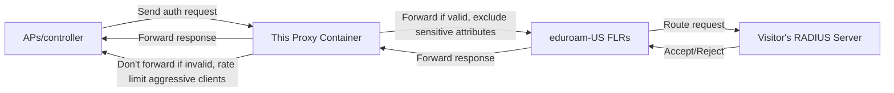

# eSO-hostable containerized FreeRADIUS filtering proxy for SP-only eduroam deployments
This is a containerized eduroam filtering proxy using FreeRADIUS, pre-configured and tailored for SP-only deployments in the US. Host it at an eSO and have a constituent point their APs/controller at this instead of directly at the eduroam national proxies. This can also be hosted directly on the constituent's own network if they have spare computing power via a tiny PC, SOHO-grade NAS appliance, AP/router combo, etc.

The idea is to enable not-so-fully-featured wireless gear to play nicely with the eduroam-US service even if the AP/controller can't make simple policy decisions like dropping realm-less auth requests, which will always fail when they hit the national proxies. Some wireless gear will include information like the AP make/model or physical location (e.g. BldgA-2F-WC) in their RADIUS requests, so we also filter out these common leaky attributes.

Ideally, you would deploy one proxy container (two if you have redundant hosting capability) per constituent so any roaming stats delivered by the NRO aren't aggregated together with other constituents.

## Table of Contents

- [Setup](#setup)
  - [eduroam registration](#eduroam-registration)
  - [Container hosting](#container-hosting)
  - [The end result](#the-end-result)
- [Building and running the container](#building-and-running-the-container)
  - [Environmental variables](#environmental-variables)
  - [Logging](#logging)
- [Building and updating](#building-and-updating)
  - [Security updates and considerations](#security-updates-and-considerations)

## OK, but why?
One of our goals as an eSO is to remove as many barriers as possible for community partners to add eduroam to their public wi-fi offerings, even in very simple deployments. The main drivers/goals behind this stripped-down fork of [eso-tools](https://github.com/nshe-scs/public-eso-tools) are:
- It's hard to follow good eduroam practices when your wireless hardware vendor sells/rents products with 802.1x support, but forces you to buy additional products for basic policy decisions like `if 'RADIUS User-Name' contains '@', then: forward to 'eduroam_proxies', else: reject`.
- Less-resourced organizations wanting to offer eduroam as a public service to educators and students shouldn't require deep RADIUS or Linux expertise. Their eSO should be able to abstract away the finer details "as a Service".
- Make it easy to point RADIUS/802.1x auth at this container, and get basic eduroam-compatible username filtering and proxy rate limiting to reduce auth waste and get clean usage reports from eduroam-US. Because logging is built in, an eSO hosting this proxy also helps constituents meet eduroam logging requirements; see [Logging](#logging) below.
- Contribute our work back to the broader education community. While we're focused on spurring eduroam adoption in our neck of the woods, this is still broadly applicable (just not fine-tuned) to larger organizations and other countries.

# Setup
## eduroam registration
We assume you're a US-based [eduroam Support Organization (eSO)](https://incommon.org/eduroam/eduroam-k12-libraries-museums/), but maybe you're a municipality or community center wanting to add eduroam as a secure wi-fi option to support your local education community... In any case, you must be able to register an SP in the eduroam infrastructure. US-based organizations do this via Internet2's Federation Manager tool. If you don't know what that is, reach out to Internet2 or your state's eSO. 

You will assign a unique shared secret to each constituent for their wireless gear to talk to their respective proxy container, but you _must register a single shared secret in Federation Manager for all containers living on the same container host_ because we use RADIUS over UDP.

Redundant containers for the same constituent on separate hardware can also share the same name; the combination of `public IP`, `port`, and `secret` uniquely identifies your proxy container to the eduroam-US proxies.

## Container hosting
We provide a sample `docker-compose.yml` and `custom.env` to help you get started quickly. We test with docker and podman, e.g. using `docker compose` and `podman-compose`. These are the only two files you need to edit.

You don't need to be a containerization or DevOps expert, but you'll need to understand the very basics of running a container. Ideally two containers on separate hardware and/or locations for redundancy.

This is a fairly small container. You can run it in a Linux VM, rackmount enterprise server hardware, sub-$200 micro-PC, cram it onto a SOHO-grade NAS in your closet or use fancy orchestration in the cloud... whatever is available to you.

### Hosting for multiple constituents - examples
If you're an eSO, we suggest preparing a single name in DNS like `proxy.roam.(your-eso-domain)`, e.g. `proxy.roam.example.org`, with _one IP per redundant hosting location_ and _one unique port number per constituent_. By using unique containers for each constituent, you ensure their roaming stats aren't co-mingled or aggregated together at the NRO. You also give yourself flexibility for updates and reduce the risk of impacting multiple constituents when testing or changing things down the road.

For example, in the scenario below we an eSO with 2 datacenters / network closets running docker (the container host) on a tiny PC or simple Linux VM. Note that they share a public DNS name resolving to multiple public IPs.

| Container host    | Internal DNS name  | Internal IP | Public DNS name / FQDN | Public / NAT IP |
|-------------------|--------------------|-------------|------------------------|-----------------|
| west-office-box-1 | vmhostw1.eso.local | 10.10.0.1   | proxy.roam.example.org | a.b.c.d         |
| east-office-box-1 | vmhoste9.eso.local | 10.20.0.9   | proxy.roam.example.org | w.x.y.z         |

They each host identical containers for their 4 constituents. No replication or load balancing is needed.

| Constituent    | Container name | Container IP                    | Mapped UDP port |
|----------------|----------------|---------------------------------|-----------------|
| Example City   | city-example   | docker auto-assigned private IP | 49152->1812     |
| Example County | county-example | docker auto-assigned private IP | 49153->1812     |
| Example Museum | museum-example | docker auto-assigned private IP | 49154->1812     |
| Example Cafe   | cafe-example   | docker auto-assigned private IP | 49155->1812     |

The constituents are each registered by the eSO in Federation Manager as seperate organizations, with 2 SP (hotspot) RADIUS entries. So for Organization `Example City`:

| SP (hotspot) RADIUS friendly name | IP and port
|-----------------------------------|---------------|
| city-example west                 | a.b.c.d:49152 |
| city-example east                 | w.x.y.z:49152 |

... and for `Example Museum`:

| SP (hotspot) RADIUS friendly name | IP and port   |
|-----------------------------------|---------------|
| museum-example west               | a.b.c.d:49154 |
| museum-example east               | w.x.y.z:49154 |

## The end result



Once the proxy is live, have your constituent create a WPA2/3-Enterprise network named "eduroam" (case-sensitive), with is 802.1x/RADIUS auth pointed at the proxy container IP + port with a random secret you assigned them. Only enable RADIUS authentication, not accounting.

If a constituent's wireless gear only supports using a single RADIUS server, point them at whichever container host has the shortest network path or ping time. Otherwise, point them at both and use failover, not round-robin, if possible.

A successful auth will flow as an encrypted EAP conversation from visitor device -> constituent wi-fi (SP) -> your proxy -> FLR (eduroam infrastructure) -> visitor's school/college (IdP) -> (back), and common privacy-leaking optional RADIUS attributes are dropped at the proxy.

Malformed auth requests from eduroam visitors such as non-EAP auths and realm-less usernames, and rapidly repeating auth requests from the same client device be rejected quickly by the proxy, saving traffic from your proxy -> FLR -> (back). Such misbehavior is unfortunately normal and often outside the user's control due to default client settings.

# Building and running the container
Build and run with the supplied `Dockerfile`, `docker-compose.yml`, and `custom.env`. E.g.

```
cd /path/to/freeradius-proxy-container/

vim docker-compose.yml # edit to set container details (refer to comments in file)
vim custom.env # set the env vars that will drive the container (refer to comments in file or see below)
# we strongly recommend enabling debug mode in custom.env until you're sure everything is working

docker compose up --build -d && docker logs (container name) -f
```

## Environmental variables
However you choose to run it, whether manually or via an automation/orchestration tool, the container configuration is completely driven by environmental variables. The entrypoint script will put the important details in the correct places in the various freeradius config files during container startup, and link the correct sites/mods/etc. based on your needs. We recommend setting these variables via the supplied `custom.env` file. You'll need one per container.

`FR_MY_FQDN`: What the proxy should believe is its fully qualified hostname, e.g. `(container-name).proxy.roam.example.org`. See [Container hosting](#container-hosting) for guidance.

`FR_FLR_SECRET`: The RADIUS shared secret you registered in Federation Manager for your container host, e.g. a random 63-character mixed-case alphanumeric string. A quick method to generate one: `echo $(tr -dc 'A-Za-z0-9' </dev/urandom | head -c63)`.

`FR_FLR_IP_1`: IP address or FQDN (only resolved at startup) of the first federation level RADIUS proxy, e.g. `163.253.30.2` or `tlrs2.eduroam.us` for eduroam-US near the west coast.

`FR_FLR_IP_2`: IP address or FQDN (only resolved at startup) of the other federation level RADIUS proxy, e.g. `163.253.31.2` or `tlrs1.eduroam.us` for eduroam-US near the east coast.

`FR_WAP_SECRET`: The RADIUS shared secret you expect the wireless APs / controller to use when talking to this container, e.g. a random 63-character mixed-case alphanumeric string. It MUST NOT be the same as `FR_FLR_SECRET`.

`FR_WAP_IP`: A comma-delimited list of IP addresses and/or CIDR subnets of the constituent's wireless APs / controller that will send authentication requests to this container, e.g. `192.168.0.1,192.168.1.1/24`. These are the only IPs the container will treat as legitimate RADIUS clients. Be aware of whether NAT is at play; your constituent may not realize that their `192.168.0.1` is really your `1.2.3.4`. You will also need to ensure traffic can make it to your container from these IPs.

`FR_VLAN_VISITORS`: VLAN number to assign to eduroam visitors when authentication succeeds. Leave it blank if the constituent doesn't use or support VLANs, or if they can assign VLANs without help from a RADIUS server.

## Logging
**Remember, this container only handles authentication, so the constituent is still on the hook for logging which IP their DHCP server assigned to a given MAC at a given time on their network.**

Anyone operating an eduroam IdP or SP is required to keep sufficient logs for troubleshooting. FreeRADIUS, particularly in debug mode, can be _very_ chatty, and this is a good thing. But you won't run this in production with debugging enabled, and you likely don't have infinite space for logs. We try to log the minimum necessary information for troubleshooting, including a `Correlation-Id` for each EAP session.

`FR_LOG_DESTINATION`: Either `syslog` (recommended) or `file`.

### syslog (recommended)
If you have a remote syslog host or SIEM, take advantage of its collection, searching, and compression capabilities. The following must be set:

`FR_LOG_SYSLOG_HOST`: IP or FQDN of your syslog host.

`FR_LOG_SYSLOG_PORT`: Port number your syslog host is listening on.

`FR_LOG_SYSLOG_PROTO`: Either `tcp` (recommended) or `udp`, depending on your syslog server's capabilities.

`FR_LOG_SYSLOG_FAC`: syslog facility name that FreeRADIUS logs should use. We recommend `local1` but this is arbitrary.

`FR_LOG_SYSLOG_SEV`: syslog severity level that FreeRADIUS logs should use. We recommend `notice` but this is arbitrary.

### File based logging (only use with persistent storage!)
If you don't have a syslog receiver, the container will log to a file inside the container instead: `/var/log/freeradius/eduroam.log`. You must persistently map / bind this to a local path using your container host's recommended method, otherwise your logs will disappear when your container stops. It's up to you to rotate and trim the log with a tool of your choice from your container host; the container won't do it for you.

# Building and updating
We use the latest official Alpine-based FreeRADIUS container, add the syslog-ng package, and copy our eduroam-US friendly config files over at container build time. We apply actual configuration details during run time. Thus, you can destroy and rebuild the container every day and it will work the same way every time, as long as you feed it the same environmental variables.

The `entrypoint.sh` script does the heavy lifting of turning your env vars into a working config; you don't need to touch FreeRADIUS directly.

If you want to add/modify/delete clients, log settings, etc. once the container is running, just update the container's environment, e.g. via `custom.env`, and restart the container. Don't forget to update your firewall rules if applicable.

## Security updates and considerations
Security updates take the form of pulling and rebuilding the container image, thereby starting from scratch with the latest patched Alpine + FreeRADIUS; destroying the currently-running container; and starting the new one. For example, you could:

```
docker compose build --pull
docker compose down
docker compose up -d
```

This is a RADIUS UDP proxy, no TCP/TLS/RadSec support at this time. While eduroam authentication is protected by the use of EAP, you should still control access to your proxy containers by configuring your firewall(s) to allow only the correct constituent's wireless gear to contact your proxies over the specific UDP port number you assigned them, and to receive UDP responses from the upstream proxies / FLRs.

You can read [more about eduroam security here](https://eduroam.org/eduroam-security/).
